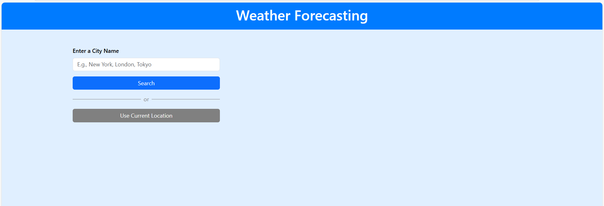
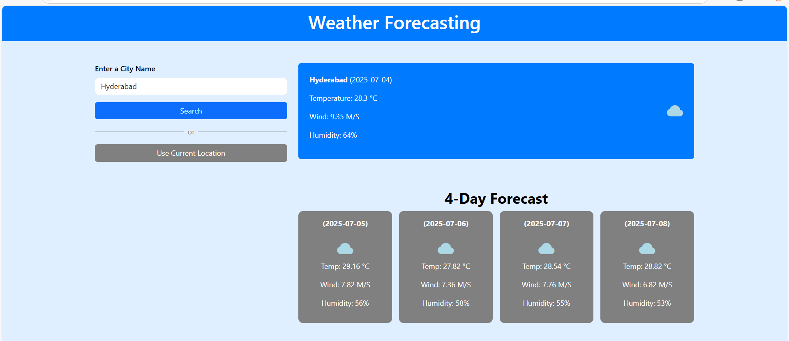

# 🌦️ Weather Dashboard

A responsive weather dashboard that allows users to search for any city and view the current weather along with a 5-day forecast. Built using **HTML, CSS, JavaScript**, and the **OpenWeatherMap API**.

---

## 🚀 Features

- 🔍 City search with live weather data
- 🌡️ Current temperature, wind speed, and humidity
- 📅 5-day forecast with weather icons
- 🕘 Search history stored in localStorage
- 🌍 Toggle between °C and °F (optional enhancement)
- 📱 Responsive design for all devices

---

## 🛠️ Technologies Used

- HTML5
- CSS3
- JavaScript (ES6)
- OpenWeatherMap API

---

## 📸 Screenshots

### 🟢 Initial State
Displays a clean layout with a search input, ready for user interaction.

### 🌤️ Final State
Shows the current weather and a 5-day forecast after searching for a city.

---

## 🔗 Live Demo

👉 [View Live Project](https://tharuniporeddy.github.io/Weather-Dashboard/)
